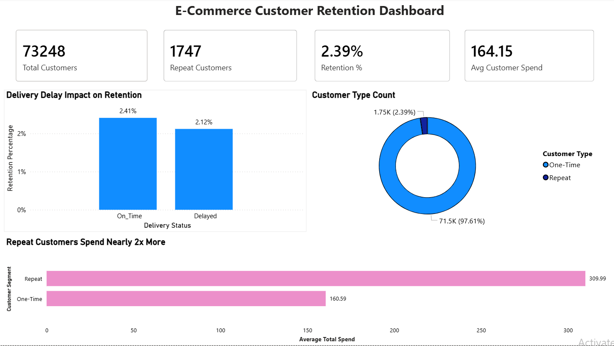
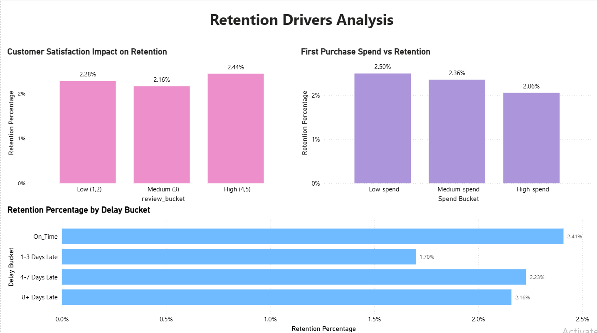
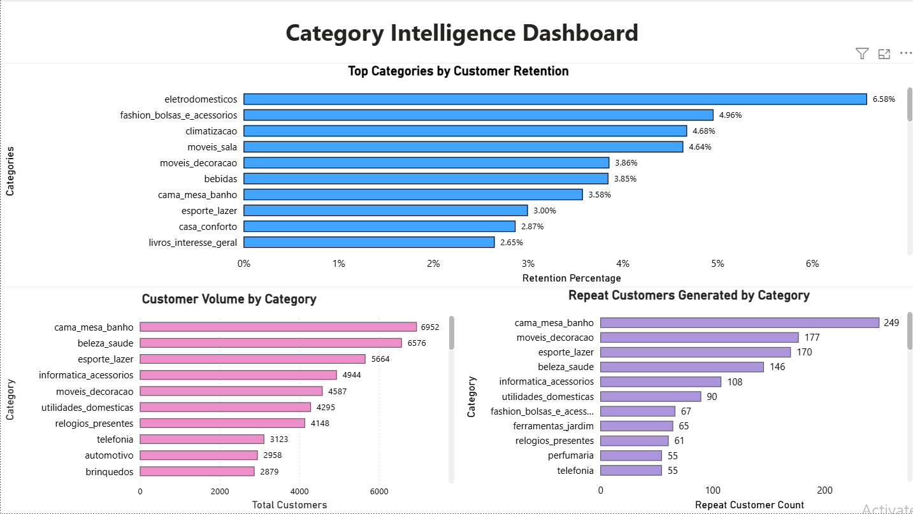

# 📊 E-Commerce Customer Retention Analysis (SQL + Power BI)

## 📌 Project Overview

This project analyzes customer repeat purchase behavior for an e-commerce marketplace using SQL and Power BI.

The objective was to understand:

* Why retention was low
* Which customer experiences impacted repeat purchase
* Which customer segments were more valuable
* Which product categories created stronger loyalty

The project combines **SQL analytics** with **Power BI dashboard storytelling**.

---

## 🛠 Tools Used

* MySQL Workbench
* SQL
* Power BI
* GitHub

---

## 📈 Dashboard Preview

### Executive Overview

### Retention Drivers

### Category Intelligence

---

## 🔍 Key Business Insights

### 1. Retention Was Low

* Total Customers: 73,248
* Repeat Customers: 1,747
* Retention Rate: 2.39%

### 2. Delayed Deliveries Hurt Loyalty

Customers with delayed first orders returned less often.

### 3. Repeat Customers Were Far More Valuable

Repeat customers spent nearly **2x more** than one-time buyers.

### 4. High First Purchase Spend Did Not Guarantee Loyalty

Large first baskets did not create stronger retention.

### 5. Category Choice Influenced Retention

Some product categories retained customers nearly 3x better than platform average.

---

## 📁 Files Included

* SQL analysis queries
* Power BI dashboard (.pbix)
* Dashboard screenshots
* README summary

---

## 💡 Skills Demonstrated

* SQL Joins
* CTEs
* Window Functions
* Data Cleaning
* Customer Analytics
* Retention Strategy
* Power BI Dashboarding
* Business Storytelling

---

## 👤 Author

**Sarthi Khator**
Aspiring Data Analyst focused on SQL, Power BI, and business analytics.
